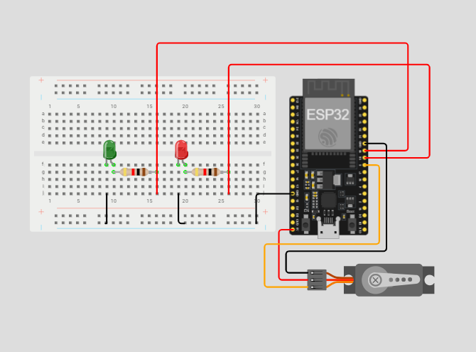
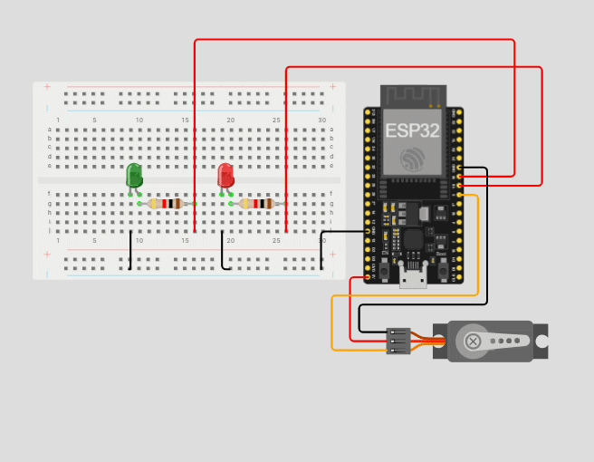

# ESP32 Servo Motor Control Using a Web Page

## Overview

This project demonstrates how to control a servo motor using an **ESP32 WEMOS D1 Mini** and a **web-based control page**. The ESP32 is configured as a **Wi-Fi Access Point** and hosts a simple webpage containing **Open** and **Close** buttons.

When the **Open** button is pressed, the servo moves to the open position, the green LED turns on, and the red LED turns off. When the **Close** button is pressed, the servo moves to the closed position, the red LED turns on, and the green LED turns off.

The project was first designed and tested in **Wokwi** to verify the servo motor, LEDs, and circuit connections before being implemented on the physical ESP32 hardware.

Two different stages of testing were used during development:

- A simple test was used in **Wokwi** to verify the circuit, servo, and LEDs.
- A **Wi-Fi web server** was then used for the real-world implementation to control the servo and LEDs through a webpage.

---

## Features

- ESP32 configured as a **Wi-Fi Access Point**.
- Web-based control interface with **Open** and **Close** buttons.
- Servo motor controlled through a webpage.
- Green LED indicates the open state.
- Red LED indicates the closed state.
- Circuit designed and tested in **Wokwi**.
- Successfully implemented on a physical **ESP32 WEMOS D1 Mini**.
- Wireless control without requiring an external Wi-Fi router.

---

## Components

- ESP32 WEMOS D1 Mini
- Servo Motor
- Green LED
- Red LED
- 2 × Resistors
- Breadboard
- Jumper Wires

---

## Circuit Connections

### Servo Motor

| Wire | ESP32 |
| ---- | ----- |
| Brown (GND) | GND |
| Red (VCC) | Power Supply |
| Orange (Signal) | GPIO 5 |

### Red LED

| Connection | ESP32 |
| ---------- | ----- |
| Anode (+) | GPIO 18 through a 220Ω resistor |
| Cathode (-) | GND |

### Green LED

| Connection | ESP32 |
| ---------- | ----- |
| Anode (+) | GPIO 19 through a 220Ω resistor |
| Cathode (-) | GND |

---

## How It Works

The project operates in two main stages: circuit testing and web-based control.

### Wokwi Circuit Test

The circuit was first created and tested in **Wokwi**.

The initial test automatically switches between the closed and open states every three seconds. This was used to make sure that the servo motor and both LEDs were connected correctly before adding the Wi-Fi functionality.

During the Wokwi test:

- **Closed:** Servo moves to **90°**, red LED turns ON, and green LED turns OFF.
- **Open:** Servo moves to **180°**, red LED turns OFF, and green LED turns ON.

After confirming that the servo and LEDs operated correctly in Wokwi, the project was moved to the web-control implementation.

### Real-World Web Control

For the real-world use case, the ESP32 was configured as a **Wi-Fi Access Point** and a web server.

The ESP32 creates its own Wi-Fi network named:

`ESP32-Servo`

A device can connect directly to this network and access the webpage through the ESP32's IP address.

The webpage contains two buttons:

- **OPEN**
- **CLOSE**

When the **Open** button is pressed:

- The servo moves to **180°**.
- The green LED turns ON.
- The red LED turns OFF.

When the **Close** button is pressed:

- The servo moves to **90°**.
- The red LED turns ON.
- The green LED turns OFF.

---

## Circuit Design

### Wokwi Circuit



---

### Circuit Animation



---

### Live Simulation

Explore the interactive Wokwi simulation to view the complete circuit, inspect the wiring, and run the ESP32 program.

🔗 **Wokwi Project:** [**Click Here!**](https://wokwi.com/projects/471754918150336513)

> You can:
> - Run the simulation
> - Inspect the complete circuit wiring
> - View and edit the ESP32 project
> - Observe the servo movement
> - Observe the red and green LED states
> - Inspect the complete circuit connections

---

## Hardware Demonstration


The final project was implemented on a physical **ESP32 WEMOS D1 Mini**.

The ESP32 creates its own Wi-Fi Access Point, allowing a connected device to access the control webpage and operate the servo motor remotely.

---

## Web Control

The ESP32 creates its own Wi-Fi network with the following settings:

| Parameter | Value |
| --------- | ----- |
| Wi-Fi Network | ESP32-Servo |
| Password | 12345678 |
| IP Address | 192.168.4.1 |

After connecting to the ESP32 Wi-Fi network, the user can open:

`192.168.4.1`

The webpage provides two controls:

### Open

When the **OPEN** button is pressed:

```text
OPEN
 ↓
Servo → 90°
🟢 Green LED → ON
🔴 Red LED → OFF
```

### Close

When the **CLOSE** button is pressed:

```text
CLOSE
 ↓
Servo → 0°
🔴 Red LED → ON
🟢 Green LED → OFF
```

---

## Customization

You can easily modify the system by changing the following values:

| Parameter | Default |
| --------- | ------- |
| Wi-Fi Network Name | ESP32-Servo |
| Wi-Fi Password | 12345678 |
| Open Servo Position | 180° |
| Closed Servo Position | 90° |
| Servo Signal Pin | GPIO 5 |
| Red LED Pin | GPIO 18 |
| Green LED Pin | GPIO 19 |

---

## Future Improvements

- Add servo position feedback to the webpage.
- Add a status indicator showing whether the servo is currently open or closed.
- Improve the webpage design with animations and responsive controls.
- Add multiple servo motors controlled from the same webpage.
- Add password authentication for the web interface.
- Add an emergency stop button.
- Add a more advanced user interface for monitoring the servo state.

---

## License

This project is intended for educational purposes.

---

# 👩‍💻 Author

**Nassebah Al-Dubayyan**

Computer Science Student
